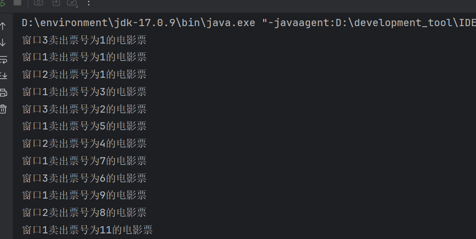
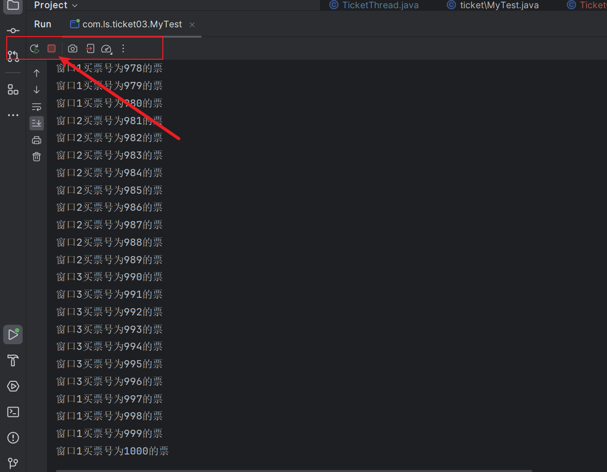
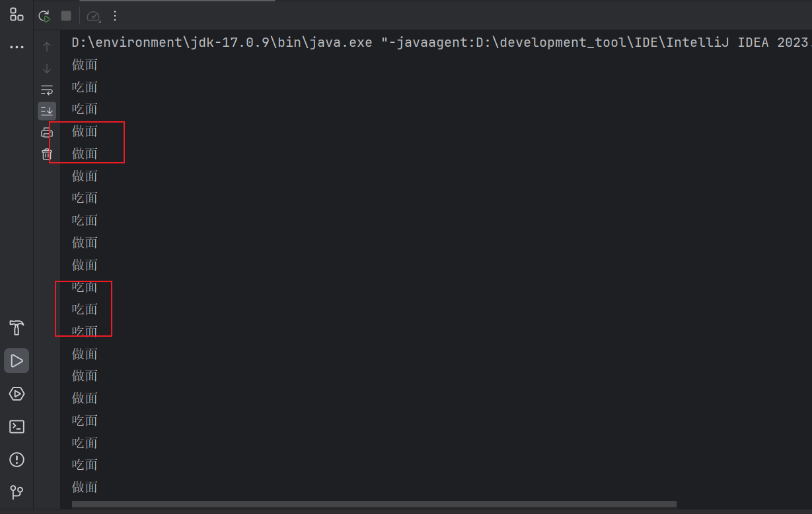
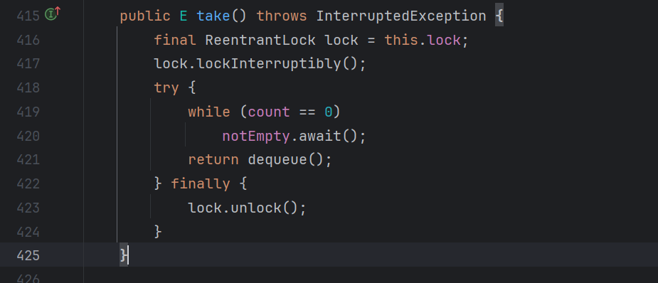
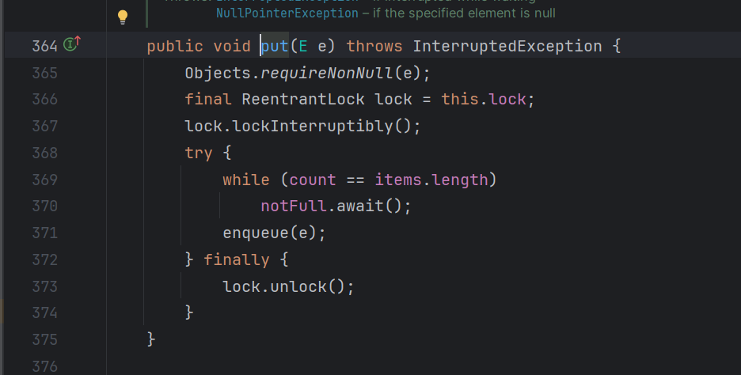

# 多线程

## 进程和线程

* 进程：进程是资源分配的基本单位。是程序执行的实体
* 线程：线程是cpu调度的基本单位。进程里面包含多个线程。

关系如图所示

整个电脑管家是一个进程。

线程是电脑管家里面的某个功能。

上述关系可以概述为，进程是一个软件，线程是软件里某个特定的功能。


一个软件有多个线程就是多线程。

## 多线程的应用场景

* 文件的拷贝，迁移
* 加载大量的资源文件
* 聊天软件
* 后台服务器


 

## 线程的创建

### 1.继承Thread类

```java
/**
 * 创建线程的第一种方式
 * 1.继承Thread类
 * 2.重写run方法
 * 3.创建线程
 * 4.启动线程
 *
 */
public class Threaddemo extends Thread{
    @Override
    public void run() {
        //编写线程的业务，如打印20次线程的名字
        for(int i = 0; i < 20; i ++){
            System.out.println(("我是"+getName()));
        }

    }

    public static void main(String[] args) {
        Threaddemo t1 = new Threaddemo();
        Threaddemo t2 = new Threaddemo();
//        System.out.println(t1.getName());  Thread-0
//        System.out.println(t2.getName());  Thread-1
        t1.start();
        t2.start();
    }
}

```


看执行结果，是线程0和线程1交替执行的（并发执行）。

* 并发： 统一时间间隔内，多个线程同时执行（宏观上是同时，起始是交替执行）。
* 并行：统一时刻，多个线程同时执行。（多个cpu 执行多个线程）。

### 2.实现Runnable类

```java

/**
 * 创建线程的第二种方式
 * 1.自定义类实现Runnable类
 * 2.重写run方法
 * 3.创建自定义类
 * 4.创建Thread类 并传参，参数是自定义类  现在才是线程
 * 5.启动线程
 *
 */
public class Threaddemo1 implements  Runnable {
    @Override
    public void run() {
        //该线程业务
        //打印20次该线程的名字
        /*
        由于该类是继承Runnable类Runnable还不是线程，需要将该类作为参数给Thread类，才能成为线程
        要先获取线程的名字，要先获得线程。
        * */
        Thread thread = Thread.currentThread();
        for(int i = 0; i < 20; i ++){
            System.out.println("我是"+thread.getName());
        }
    }

    public static void main(String[] args) {
        Threaddemo1 threaddemo1 = new Threaddemo1();
        Thread t1 = new Thread(threaddemo1);
        Thread t2 = new Thread(threaddemo1);
        t1.start();
        t2.start();
    }
}

```

执行如下


线程并发执行。

### 3.利用Callable接口和Future接口

```java
/**
 * 实现线程的第三种方式
 *      z
 * 利用 Callable接口和 Future 接口方式 实现
 *      这种方式可以获取线程的返回结果，前两种的返回值都是void。
 * 1.自定义类实现Callable接口 ,指定返回的类型给泛型，重写Call方法（业务）
 * 2.创建自定义类对象
 * 2.创建FutureTask 对象（管理call的返回结果）
 */
public class Threaddemo2 implements Callable<Integer> {
    /**
     * 1到100的和
     * @return
     * @throws Exception
     */
    @Override
    public Integer call() throws Exception {
        int sum = 0;
        for (int i = 0; i < 100; i++) {
            sum += i;
        }
        return sum;
    }

    public static void main(String[] args) throws ExecutionException, InterruptedException {
        Threaddemo2 threaddemo2 = new Threaddemo2();
        FutureTask<Integer> ft = new FutureTask<>(threaddemo2);
        Thread t1 = new Thread(ft);
        t1.start();
        Integer i = ft.get();
        System.out.println(i);
    }
}
```


## 区别

​	实现 Runnable 和 Callable 接口的类只能当做一个可以在线程中运行的任务，不是真正意义上的线程，因此最后还需要通过 Thread 来调用。可以理解为任务是通过线程驱动从而执行的。

实现接口会更好一些，因为：

+ Java 不支持多重继承，因此继承了 Thread 类就无法继承其它类，但是可以实现多个接口；
+ 类可能只要求可执行就行，继承整个 Thread 类开销过大。

## 线程的成员方法


tips：线程的调度有两种方式，一种是非抢占式调度,线程轮流获取cpu执行。另一种是抢占式调度，cpu在执行某个线程时，还未执行完有更高优先级的线程回抢占cpu。

* setPriority(int x)  x的范围时1~10，10优先级最大。默认优先级是5

* ```java
  守护线程  final void setDaemon(boolean on)
  *    当非守护线程结束，守护线程就没有存在的必要，后续也会结束（可能不是执行到最后）
  ```

  守护线程的应用场景， QQ聊天窗口，同时发送文件。当QQ聊天窗口结束，发送文件(守护线程)也会结束。

* ```java
  礼让线程/出让线程
   *      public static native void yield();
   *      线程让出cpu的控制权
   *      礼让不是绝对的，获得cpu后，礼让其他线程，但是当cpu重新分配的时候还是有机会分配到礼让线程。
   *      非强制性：Thread.yield()方法的调用是建议性的，并不保证当前线程会立即放弃CPU资源。因此，它不能用于实现严格的线程同步或控制线程的执行顺序。
   *      状态不变：线程在调用Thread.yield()方法后，其状态不会发生变化，仍然是就绪状态。这意味着它仍然有资格参与CPU资源的竞争。
   *      使用场景：Thread.yield()方法通常用于那些对执行顺序要求不高的场景，或者当线程发现自己无法继续执行（如等待某个资源） 时，主动让出CPU资源以提高系统的整体性能
   *
  ```

* ```java
  /** 插入线程
   * final synchronized void join(final long millis) 等待该线程终止的时间最长为millis毫秒。
   * final synchronized void join(long millis, int nanos) 等待该线程终止的时间最长为millis毫秒 + nanos纳秒。
   * final void join()
   *  插入线程，在A线程中 执行B.join(),回先执行B线程完毕在，在执行A进程。
   *注意事项
   * 死锁：如果线程A等待线程B，而线程B又在等待线程A（直接或间接地），那么这两个线程就会陷入死锁状态。
   * 性能影响：虽然join方法对于线程同步非常有用，但它也可能导致性能问题，特别是当等待的线程需要很长时间才能完成时。
   * 异常处理：join方法会抛出InterruptedException，因此调用它的代码需要处理这个异常，或者将异常声明在方法签名中。
   * join方法是Java多线程编程中实现线程间同步的一种重要手段，通过合理使用join方法，可以确保线程的执行顺序，从而满足复杂的业务逻辑需求。
   */
  ```

## 线程的生命周期

即线程的状态

* 新建状态（NEW）
  * 创建后尚未启动。
* 就绪状态(Runnable)
  * Thread.start()后。线程处于就绪态。此时，线程已经做好了执行的准备，但还没有获得CPU的执行权，处于等待CPU分配资源（时间片）的阶段。
* 运行状态（Running）
  * 当就绪的线程被调度并获得CPU资源时，线程进入运行状态，开始执行`run()`方法中的任务。在这个过程中如果run()执行完毕，线程就回死亡变成垃圾。如果被更高优先级的线程抢夺处理机资源回回到就绪态，等待着cpu分配。
* 阻塞状态（Blocked）
  * 线程在运行过程中，线程sleep或者其他阻塞方式（如等待I/O操作完成、等待锁）。回导致线程阻塞。sleep（）方法结束或其他阻塞方式结束，回到就绪态。
  * 阻塞分类
    + 等待阻塞：线程调用`wait()`方法或`join()`方法，等待其他线程执行完毕或超时。
    + 同步阻塞：线程在获取同步锁失败时，会进入同步阻塞状态。
    + 其他阻塞：如调用`sleep()`方法、发出I/O请求等。
* 死亡状态（Dead）
  * 线程run()方法执行完毕，或者异常结束,线程进入死亡状态。此时，线程的生命周期结束，线程所占用的资源被释放。。


## 多线程的安全问题

> 电影院在三个售票窗口买100张票。

三个窗口买票相当于三个线程。共享一个变量最大值为100。

**线程方法**

```java
/**
 * 三个窗口买100张，电影票
 */
public class TicketThread extends Thread{

    /*
    静态变量（Static Variable）：
    静态变量是在程序执行期间仅被初始化一次的变量。无论声明它的代码块被执行多少次，静态变量都只会被初始化一次。
    静态变量的生命周期贯穿整个程序运行期间，而不是局限于它们被声明的代码块。
    在类（Class）中声明的静态变量是该类的所有实例共享的。即，无论创建多少个类的实例，这些实例都访问同一个静态变量。`````
     */
    static int ticket = 1;
    @Override
    public void run() {
        while (true){
            if(ticket <= 100){
                System.out.println(getName()+"卖出票号为"+ ticket + "的电影票");
                ticket++;
            }else{
                break;
            }
        }
    }
}
```

买票过程

```java
public class MyTest {
    public static void main(String[] args) {
        TicketThread t0 = new TicketThread();
        TicketThread t1 = new TicketThread();
        TicketThread t2 = new TicketThread();
        t0.setName("窗口1");
        t1.setName("窗口2");
        t2.setName("窗口3");

        t0.start();
        t1.start();
        t2.start();
    }
}

```

执行结果



一个票买了多次，显示是不对的。这就是多线程的安全问题。

出现这种情况是因为，现在的执行顺序是不确定的，线程t0执行run方法时，执行到了输出操作，还没进行ticket++，cpu转而执行线程t1,就会出现一票多买的情况。

为了解决这种情况，引入锁Synchronized。在加锁的代码块中一次只能执行一个进程，并且进程执行全部后，才允许其他进程执行。

## Synchronized 锁

* 锁默认打开，有一个线程进去了，所自动关闭
* 锁里面的代码全部执行完毕，线程出来，锁自动打开。

### 使用 synchronized关键字的方式：

1. **同步方法**：

   + 在方法声明时使用 `synchronized` 关键字，这样该方法在同一时刻只能被一个线程访问。

   + 可以是实例方法或静态方法。如果是实例方法，则锁定的是调用该方法的对象实例；如果是静态方法，则锁定的是该类的 Class 对象。

     ```java
     public synchronized void method() {  
         // 同步代码  
     }  
     
     public static synchronized void staticMethod() {  
         // 同步代码  
     }
     ```

2. **同步代码块**：

   + `synchronized` 关键字也可以用于代码块，这样可以在方法内部指定更小的同步区域，从而提高并发性。
   + 同步代码块需要一个引用类型的锁对象。

   ```java
   public void method() {  
       synchronized(lockObject) {  
           // 同步代码  
       }  
   }
   ```

### 注意事项

+ 过度使用 `synchronized` 可能会导致性能下降，因为线程在访问同步区域时可能会发生阻塞。
+ 锁对象的选择很重要，通常应该选择私有的、不会被外部访问的对象作为锁对象，以避免不必要的线程阻塞。
  + 比如该类的字节码问文件。
+ 在设计多线程程序时，应该尽量减少同步区域的大小，以提高程序的并发性。

使用锁解决买票的问题。

```java
public class TicketThread extends Thread {

    /*
    静态变量（Static Variable）：
    静态变量是在程序执行期间仅被初始化一次的变量。无论声明它的代码块被执行多少次，静态变量都只会被初始化一次。
    静态变量的生命周期贯穿整个程序运行期间，而不是局限于它们被声明的代码块。
    在类（Class）中声明的静态变量是该类的所有实例共享的。即，无论创建多少个类的实例，这些实例都访问同一个静态变量。`````
     */
    static int ticket = 1;

    //锁对象，一定要是唯一的
    static Object obj = new Object();

    @Override
    public void run() {
        while (true) {
            //同步代码块，一次只能有一个线程执行锁里面的代码
            synchronized (obj) {
                if (ticket < 10000) {
                    try {
                    Thread.sleep(10);
                } catch (InterruptedException e) {
                    throw new RuntimeException(e);
                }
                    ticket++;
                    System.out.println(getName() + "卖出票号为" + ticket + "的电影票");
                } else {
                    break;
                }
            }
        }
    }
}
```

## Lock锁

sychtonized锁，自动上锁自动解锁。作用在方法或代码块上。在jdk5中出现了Lock锁。

Lock是锁的接口，其实现ReentrantLock。可以调用 lock（），和unlock（）。手动上锁，手动解锁。

* 使用lock锁，为了避免进入死锁状态，一般都在finnally解锁

如下程序。使用lock锁实现买票

```java
/**
 * lock锁
 * lock时接口选择实现ReentrantLock
 */
public class Ticket03Thread extends Thread {
    static int ticket = 0;
    //确保锁的唯一性
    static Lock lock = new ReentrantLock();

    @Override
    public void run() {
        while (true) {
            lock.lock();
                if (ticket < 1000) {
                    ticket++;
                    System.out.println(getName() + "买票号为" + ticket + "的票");
                } else {
                    break;
                }
            lock.unlock();
        }
    }
}

public class MyTest {
    public static void main(String[] args) {
        Ticket03Thread t0 = new Ticket03Thread();
        Ticket03Thread t1 = new Ticket03Thread();
        Ticket03Thread t2 = new Ticket03Thread();
        t0.setName("窗口1");
        t1.setName("窗口2");
        t2.setName("窗口3");

        t1.start();
        t2.start();
        t0.start();
    }
}
```




发现程序执行结束了，但是没有结束。这是因为在最后ticket=100的时候，执行break；跳出while（）。没有执行解锁操作。导致其他两个线程还在保持请求锁的状态陷入死锁。

​	为了解决这个问题，我们一般都是将解锁放在finnally{}中。选中加锁和解锁中间的代码块，CRTL+ALT+T 选择try finnally（）如下代码

```java
public class Ticket03Thread extends Thread {
    static int ticket = 0;
    //确保锁的唯一性
    static Lock lock = new ReentrantLock();

    @Override
    public void run() {
        while (true) {

            lock.lock();
            try {
                if (ticket < 1000) {
                    ticket++;
                    System.out.println(getName() + "买票号为" + ticket + "的票");
                } else {
                    break;
                }
            } finally {
                lock.unlock();
            }
        }
    }
}
```

## 等待和唤醒

在Java中，`wait()` 方法是一个用于线程间通信的重要方法，它属于 `Object` 类。当一个线程执行到某个对象的 `wait()` 方法时，它会释放这个对象锁并进入等待（阻塞）状态，直到其他线程调用该对象的 `notify()` 或 `notifyAll()` 方法来唤醒它。

* `wait()` 方法必须在同步方法或同步块中调用，因为调用 `wait()` 会立即释放当前线程持有的锁。并且让线程出入阻塞状态。
* 调用 `wait()`、`notify()` 和 `notifyAll()` 方法时，必须持有对象锁。一般都是用锁调
* 使用 `notify()` 或 `notifyAll()` 方法唤醒等待的线程时，并不会立即释放锁，而是等待当前同步代码块执行完毕后才释放锁。
* `notifyAll()` 方法会唤醒所有等待该对象的线程，而 `notify()` 方法只会唤醒其中一个等待的线程（具体哪个线程是不确定的）。

用wait和notifyall()解决生产者消费者问题。

```java
public class Desk {
    //0表示 无   1表示有
    static int foodFlag = 0;
    //锁对象
    static  Object obj= new Object();

    //消费者最多吃10碗
    static int  cont = 0;
}
/**
 * 吃货
 *  1.吃货获取到cpu
 *  2.判断桌子上有没有食物
 *  3.如果没有 就wait，等待厨师喊他。
 *  4.如果有就吃，吃完通知厨师在做。
 */
public class Consumer extends Thread {
    @Override
    public void run() {
        while (true){
            synchronized (Desk.obj){
                System.out.println("吃货来了");
                if(Desk.cont < 10){
                    if(Desk.foodFlag == 1){
                        Desk.cont++;
                        System.out.println("吃货吃饭-" + Desk.cont);

                        Desk.foodFlag = 0;
                        //唤醒厨师
                        Desk.obj.notifyAll();
                    }else {
                        try {
                            //等待厨师做，就是让出cpu执行。 wait()会立刻释放锁，并让线程处于等待状态。
                            //这样厨师就能拿到锁，和cpu的使用
                            System.out.println("吃货等待，让出cpu和锁");
                            Desk.obj.wait();
                        } catch (InterruptedException e) {
                            throw new RuntimeException(e);
                        }
                    }
                }else {
                    break;
                }
            }
        }
    }
}

/** 厨师
 *  1.判断桌子上有没有食物
 *  2.没有食物，就做，做完通知吃货（因为吃货因为桌子上没有食物还在等待着）
 *  3.有食物，就等待着。（等待吃货告知没有食物）
 *
 */
public class Producer extends Thread{
    @Override
    public void run() {
        while (true){
            if(Desk.cont < 10){
                synchronized (Desk.obj){
                    System.out.println("厨师来了");
                    if(Desk.foodFlag == 0 ){ //如果没有食物
                        System.out.println("厨师做食物");
                        Desk.foodFlag = 1;
                        //唤醒处于等待状态的吃货
                        Desk.obj.notifyAll();
                    }else { //如果有食物
                        try {
                            System.out.println("生产者等待，让出锁和cpu");
                            Desk.obj.wait();//让出锁和cpu，让吃货拿到。
                        } catch (InterruptedException e) {
                            throw new RuntimeException(e);
                        }
                    }
                }

            }else {
                break;
            }

        }

    }
}

/**
 * Producer-Consumer 生产者消费者问题
 *      一个吃货，一个厨师，一个桌子。 吃货吃10碗面 厨师做10碗面
 *
 */
public class MyTest {
    public static void main(String[] args) {
        Consumer consumer = new Consumer();
        Producer producer = new Producer();
        consumer.start();
        producer.start();
    }
}

```

## 阻塞队列

阻塞队列（Blocking Queue）是一种特殊的队列，它支持两个附加的操作：在队列为空时，获取元素的线程会等待队列变为非空；在队列已满时，存储元素的线程会等待队列可用。这种队列通常用于生产者-消费者问题中，以在并发编程中实现线程间的同步和通信。

Java的`java.util.concurrent`包中提供了多种阻塞队列的实现，包括但不限于：

+ **ArrayBlockingQueue**：基于数组结构的有界阻塞队列。
+ **LinkedBlockingQueue**：基于链表结构的阻塞队列，如果创建时没有指定容量，则默认为`Integer.MAX_VALUE`，即无界队列。

下面是利用阻塞队列实现生产者消费者问题。

```java
**
 * 消费者
 */
public class Cook  extends Thread{
    //只吃10次
    private  int count = 0;
    private ArrayBlockingQueue blockingQueue;

    public ArrayBlockingQueue getBlockingQueue() {
        return blockingQueue;
    }

    public void setBlockingQueue(ArrayBlockingQueue blockingQueue) {
        this.blockingQueue = blockingQueue;
    }

    @Override
    public void run() {
        while (true){
            if(count <10){
                try {
                    blockingQueue.take();
                    count++;
                    System.out.println("吃面");
                } catch (InterruptedException e) {
                    throw new RuntimeException(e);
                }
            }else {
                break;
            }
        }
    }
}

/**
 * 生产者
 */
public class Foodie extends Thread {
    //只做10次
    private  int count = 0;
    private ArrayBlockingQueue blockingQueue;

    public ArrayBlockingQueue getBlockingQueue() {
        return blockingQueue;
    }

    public void setBlockingQueue(ArrayBlockingQueue blockingQueue) {
        this.blockingQueue = blockingQueue;
    }
    @Override
    public void run() {
        while (true){
            if(count < 10){
                try {
                    blockingQueue.put("面条");
                    count++;
                    System.out.println("做面");
                } catch (InterruptedException e) {
                    throw new RuntimeException(e);
                }
            }else {
                break;
            }
        }
    }
}

/**
 * 利用阻塞队列实现生产者消费者问题
 */
public class Mytest {
    public static void main(String[] args) {
        //有界阻塞队列。设置大小为1.即桌子上一次只能放一个
        ArrayBlockingQueue<String> queue = new ArrayBlockingQueue<>(1);
        Cook cook = new Cook();
        Foodie foodie = new Foodie();
        cook.setBlockingQueue(queue);
        foodie.setBlockingQueue(queue);

        cook.start();
        foodie.start();
    }
}
```

问题1：**没有使用锁**，为什么能保存进程同步

问题2：**为什么下面的执行过程是无序的**。



看一下put和take源码可知。





问题一： take 和put 有锁

问题2： 输出语句在take和put外面，也就是锁的外面，输出是无序的。但是数据是有序的。