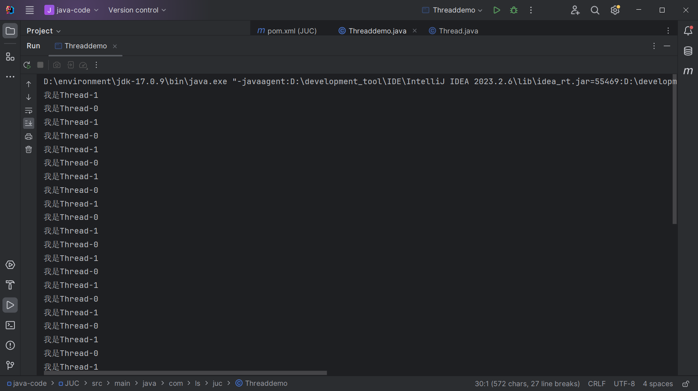
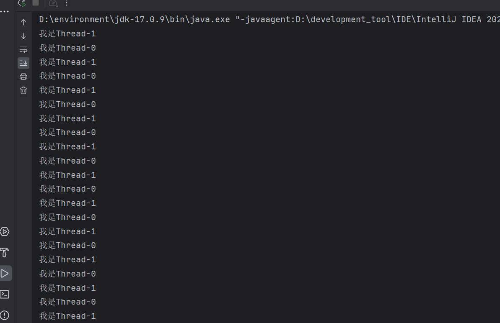
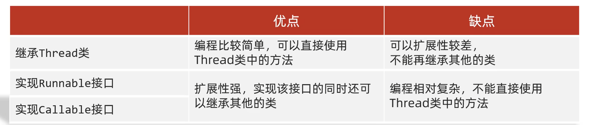
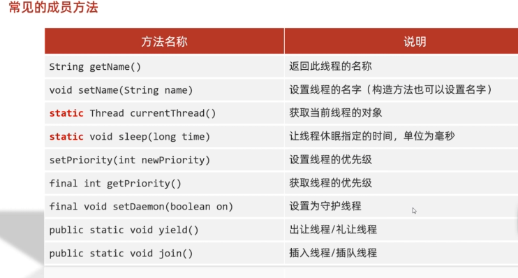

# 多线程

## 进程和线程

* 进程：进程是资源分配的基本单位。是程序执行的实体
* 线程：线程是cpu调度的基本单位。进程里面包含多个线程。

关系如图所示

整个电脑管家是一个进程。

线程是电脑管家里面的某个功能。

上述关系可以概述为，进程是一个软件，线程是软件里某个特定的功能。


一个软件有多个线程就是多线程。

## 多线程的应用场景

* 文件的拷贝，迁移
* 加载大量的资源文件
* 聊天软件
* 后台服务器


 

## 线程的创建

### 1.继承Thread类

```java
/**
 * 创建线程的第一种方式
 * 1.继承Thread类
 * 2.重写run方法
 * 3.创建线程
 * 4.启动线程
 *
 */
public class Threaddemo extends Thread{
    @Override
    public void run() {
        //编写线程的业务，如打印20次线程的名字
        for(int i = 0; i < 20; i ++){
            System.out.println(("我是"+getName()));
        }

    }

    public static void main(String[] args) {
        Threaddemo t1 = new Threaddemo();
        Threaddemo t2 = new Threaddemo();
//        System.out.println(t1.getName());  Thread-0
//        System.out.println(t2.getName());  Thread-1
        t1.start();
        t2.start();
    }
}

```



看执行结果，是线程0和线程1交替执行的（并发执行）。

* 并发： 统一时间间隔内，多个线程同时执行（宏观上是同时，起始是交替执行）。
* 并行：统一时刻，多个线程同时执行。（多个cpu 执行多个线程）。

### 2.实现Runnable类

```java

/**
 * 创建线程的第二种方式
 * 1.自定义类实现Runnable类
 * 2.重写run方法
 * 3.创建自定义类
 * 4.创建Thread类 并传参，参数是自定义类  现在才是线程
 * 5.启动线程
 *
 */
public class Threaddemo1 implements  Runnable {
    @Override
    public void run() {
        //该线程业务
        //打印20次该线程的名字
        /*
        由于该类是继承Runnable类Runnable还不是线程，需要将该类作为参数给Thread类，才能成为线程
        要先获取线程的名字，要先获得线程。
        * */
        Thread thread = Thread.currentThread();
        for(int i = 0; i < 20; i ++){
            System.out.println("我是"+thread.getName());
        }
    }

    public static void main(String[] args) {
        Threaddemo1 threaddemo1 = new Threaddemo1();
        Thread t1 = new Thread(threaddemo1);
        Thread t2 = new Thread(threaddemo1);
        t1.start();
        t2.start();
    }
}

```

执行如下



线程并发执行。

### 3.利用Callable接口和Future接口

```java
/**
 * 实现线程的第三种方式
 *      z
 * 利用 Callable接口和 Future 接口方式 实现
 *      这种方式可以获取线程的返回结果，前两种的返回值都是void。
 * 1.自定义类实现Callable接口 ,指定返回的类型给泛型，重写Call方法（业务）
 * 2.创建自定义类对象
 * 2.创建FutureTask 对象（管理call的返回结果）
 */
public class Threaddemo2 implements Callable<Integer> {
    /**
     * 1到100的和
     * @return
     * @throws Exception
     */
    @Override
    public Integer call() throws Exception {
        int sum = 0;
        for (int i = 0; i < 100; i++) {
            sum += i;
        }
        return sum;
    }

    public static void main(String[] args) throws ExecutionException, InterruptedException {
        Threaddemo2 threaddemo2 = new Threaddemo2();
        FutureTask<Integer> ft = new FutureTask<>(threaddemo2);
        Thread t1 = new Thread(ft);
        t1.start();
        Integer i = ft.get();
        System.out.println(i);
    }
}
```




## 区别

​	实现 Runnable 和 Callable 接口的类只能当做一个可以在线程中运行的任务，不是真正意义上的线程，因此最后还需要通过 Thread 来调用。可以理解为任务是通过线程驱动从而执行的。

实现接口会更好一些，因为：

+ Java 不支持多重继承，因此继承了 Thread 类就无法继承其它类，但是可以实现多个接口；
+ 类可能只要求可执行就行，继承整个 Thread 类开销过大。

## 线程的成员方法



tips：线程的调度有两种方式，一种是非抢占式调度,线程轮流获取cpu执行。另一种是抢占式调度，cpu在执行某个线程时，还未执行完有更高优先级的线程回抢占cpu。

* setPriority(int x)  x的范围时1~10，10优先级最大。默认优先级是5

* ```java
  守护线程  final void setDaemon(boolean on)
  *    当非守护线程结束，守护线程就没有存在的必要，后续也会结束（可能不是执行到最后）
  ```

  守护线程的应用场景， QQ聊天窗口，同时发送文件。当QQ聊天窗口结束，发送文件(守护线程)也会结束。

* ```java
  礼让线程/出让线程
   *      public static native void yield();
   *      线程让出cpu的控制权
   *      礼让不是绝对的，获得cpu后，礼让其他线程，但是当cpu重新分配的时候还是有机会分配到礼让线程。
   *      非强制性：Thread.yield()方法的调用是建议性的，并不保证当前线程会立即放弃CPU资源。因此，它不能用于实现严格的线程同步或控制线程的执行顺序。
   *      状态不变：线程在调用Thread.yield()方法后，其状态不会发生变化，仍然是就绪状态。这意味着它仍然有资格参与CPU资源的竞争。
   *      使用场景：Thread.yield()方法通常用于那些对执行顺序要求不高的场景，或者当线程发现自己无法继续执行（如等待某个资源） 时，主动让出CPU资源以提高系统的整体性能
   *
  ```

* ```java
  /** 插入线程
   * final synchronized void join(final long millis) 等待该线程终止的时间最长为millis毫秒。
   * final synchronized void join(long millis, int nanos) 等待该线程终止的时间最长为millis毫秒 + nanos纳秒。
   * final void join()
   *  插入线程，在A线程中 执行B.join(),回先执行B线程完毕在，在执行A进程。
   *注意事项
   * 死锁：如果线程A等待线程B，而线程B又在等待线程A（直接或间接地），那么这两个线程就会陷入死锁状态。
   * 性能影响：虽然join方法对于线程同步非常有用，但它也可能导致性能问题，特别是当等待的线程需要很长时间才能完成时。
   * 异常处理：join方法会抛出InterruptedException，因此调用它的代码需要处理这个异常，或者将异常声明在方法签名中。
   * join方法是Java多线程编程中实现线程间同步的一种重要手段，通过合理使用join方法，可以确保线程的执行顺序，从而满足复杂的业务逻辑需求。
   */
  ```

## 线程的生命周期

即线程的状态

* 新建状态（NEW）
  * 创建后尚未启动。
* 就绪状态(Runnable)
  * Thread.start()后。线程处于就绪态。此时，线程已经做好了执行的准备，但还没有获得CPU的执行权，处于等待CPU分配资源（时间片）的阶段。
* 运行状态（Running）
  * 当就绪的线程被调度并获得CPU资源时，线程进入运行状态，开始执行`run()`方法中的任务。在这个过程中如果run()执行完毕，线程就回死亡变成垃圾。如果被更高优先级的线程抢夺处理机资源回回到就绪态，等待着cpu分配。
* 阻塞状态（Blocked）
  * 线程在运行过程中，线程sleep或者其他阻塞方式（如等待I/O操作完成、等待锁）。回导致线程阻塞。sleep（）方法结束或其他阻塞方式结束，回到就绪态。
  * 阻塞分类
    + 等待阻塞：线程调用`wait()`方法或`join()`方法，等待其他线程执行完毕或超时。
    + 同步阻塞：线程在获取同步锁失败时，会进入同步阻塞状态。
    + 其他阻塞：如调用`sleep()`方法、发出I/O请求等。
* 死亡状态（Dead）
  * 线程run()方法执行完毕，或者异常结束,线程进入死亡状态。此时，线程的生命周期结束，线程所占用的资源被释放。。

